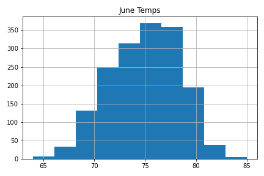

## Overview of the Analysis

Find the temperature data for the months of June and December in Oahu, in order to determine if the surf and ice cream shop business is sustainable year-round.

## Methodology 

*  Determine the Summary Statistics for June
*  Determine the Summary Statistics for December
*  A written report for the statistical analysis 

## Results

### June Weather Summary
Average June temperature in Oahu, HI is 74.9 degrees F. 
    -Highest temperature was 85.0 degrees F. 
    -Lowerst temperature was 64.0 degrees F.  
    -The difference (range) between the high and low is 21 degrees F. 

### December Weather Summary
Average December temperature in Oahu, HI is 71.0 degrees F. 
    -Highest temperature was 83.0 degrees F. 
    -Lowerst temperature was 56.0 degrees F.  
    -The difference (range) between the high and low is 27 degrees F.

### June versus December Temperatures
* The average temperatures are warmer in June than in December. 
* The range of temperatures is greater for December than for June. 
* The difference between the average temperatures for both June and December is only 3.9 degrees. We are certain that an ice cream and surf shop would be ideal in a summer month such as June; so with only a 3.9 degree difference in average temperature, December appears to be a relatively comparable month to June for weather and thusly would be a comparable month for sales. 

### Additional Analysis
* Precipitaion for June

* Precipitation for December

